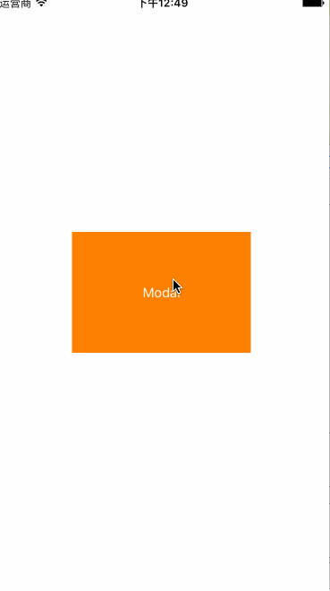
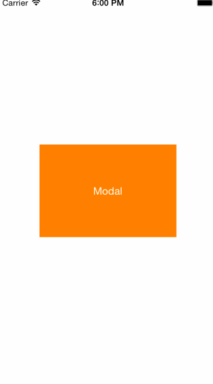

# XFCoverTransition
Custom Modal transition between UIViewController,Make it more configurable.





##Usage
###自定义modal
Add `#import "XFCoverTransition.h` to your UIViewController,the `XFPageViewController` is example of your presentedViewController,create `XFCoverTransitionTouch` main class,using `XFCTConfig` class to config your transition.
```objc
// 自定义modal
 XFPageViewController *page = [[XFPageViewController alloc] init];
 page.modalPresentationStyle = UIModalPresentationCustom;
 XFCoverTransitionTouch *ctTouch = [XFCoverTransitionTouch sharedInstance];
 ctTouch.config = [XFCTConfig configWithRenderRect:self.view.bounds animationDuration:0.25 transitionStyle:XFCoverTransitionStyleRight2Left];
 // 添加移除手势支持
 ctTouch.config.onlyForModalVCGestureDissmiss = YES;
 page.transitioningDelegate = ctTouch;
 [self presentViewController:page animated:YES completion:nil];
```
###全手势模拟modal效果
Also add `#import "XFCoverTransition.h` to your UIViewController,the `XFPageViewController` is example of your presentedViewController,create `XFCoverTransitionGesture` main class,using `XFCTConfig` class to config your transition.
```objc
@interface XFMainViewController ()
@property (nonatomic, strong) XFCoverTransitionGesture *ctGesture;
@end

@implementation XFMainViewController
- (void)viewDidLoad {
    [super viewDidLoad];
    
    XFPageViewController *page = [[XFPageViewController alloc] init];
    XFCTConfig *config = [XFCTConfig configWithRenderRect:self.view.bounds animationDuration:0.25 transitionStyle:XFCoverTransitionStyleTop2Bottom];
    self.ctGesture = [XFCoverTransitionGesture gestureWithPresentingViewController:self presentedViewController:page config:config];
}
@end

```
