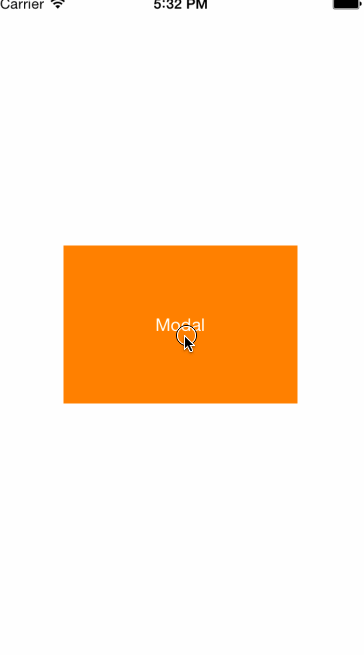

# XFCoverTransition
Custom Modal transition between UIViewController,Make it more configurable.



##Usage
First, add `#import "XFCoverTransition.h` to your UIViewController,the `XFPageViewController` is example of your presentedViewController,create `XFCoverTransitionManager` main class,using `XFCTConfig` class to config your transition.
```objc
// 使用自定义modal
 XFPageViewController *page = [[XFPageViewController alloc] init];
 page.modalPresentationStyle = UIModalPresentationCustom;
 XFCoverTransitionManager *mgr = [XFCoverTransitionManager sharedManager];
 mgr.config = [XFCTConfig configWithRenderRect:self.view.bounds animationDuration:0.75 transitionStyle:XFCoverTransitionStyleCoverRight2Left];
 page.transitioningDelegate = mgr;
 [self presentViewController:page animated:YES completion:nil];
 
 // 可以添加手势支持
 XFPageViewController *page = [[XFPageViewController alloc] init];
 XFCTConfig *config = [XFCTConfig configWithRenderRect:self.view.bounds animationDuration:0.25 transitionStyle:XFCoverTransitionStyleCoverLeft2Right];
 self.ctGesture = [XFCoverTransitionGesture gestureWithPresentingVC:self presentedVC:page config:config];
```
